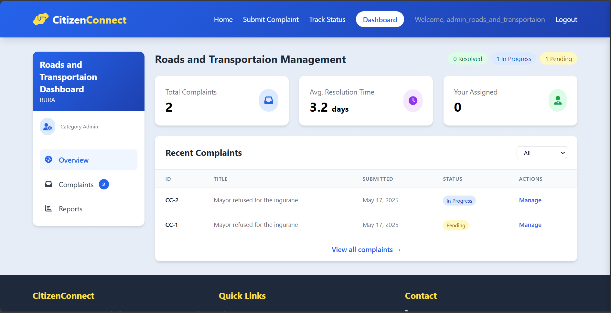
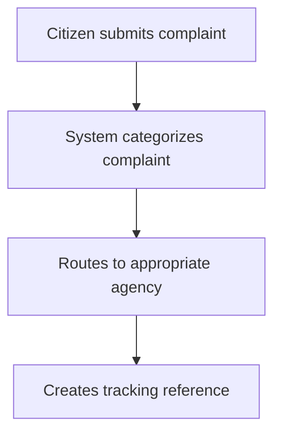
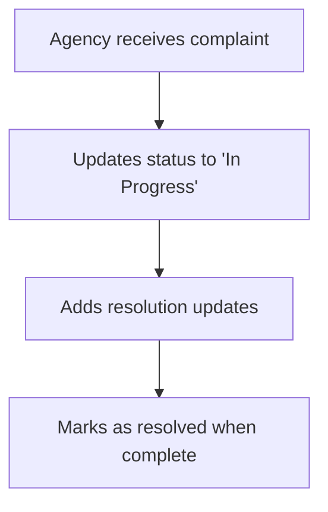

# Citizen Engagement System

        

A Django-based platform for citizens to submit complaints about public services and track their resolution status through government agencies.

## Key Features

- Citizen complaint submission with attachments
- Automated categorization and routing
- Complaint status tracking
- Government agency dashboards
- Email notifications
- Responsive design for all devices

## System Workflow

### 1. Complaint Submission


### 2. Complaint Processing


## Installation Guide

### Prerequisites

- Python 3.8+
- PostgreSQL (recommended) or SQLite
- Redis (for async tasks)

### Setup Steps

#### Clone repository
```bash
git clone https://github.com/B-Pine/citizen-engagement.git
cd citizen-engagement
```

#### Create virtual environment
```bash
python -m venv venv
source venv/bin/activate  # Linux/Mac
venv\Scripts\activate  # Windows
```

#### Install dependencies
```bash
pip install -r requirements.txt
```

#### Configure environment
```bash
cp .env.example .env
```
Edit `.env` with your:
- Database credentials
- Email settings
- Secret key

#### Run migrations
```bash
python manage.py migrate
```

#### Create admin user
```bash
python manage.py createsuperuser
```

#### Run development server
```bash
python manage.py runserver
```

## User Manual

### For Citizens

#### Submit a Complaint
- Visit `/submit/`
- Fill complaint details
- Upload supporting documents
- Receive reference number

#### Track Complaint
- Visit `/track/`
- Enter your reference number
- View status updates and responses

### For Government Staff

#### Access Dashboard
- Login at `/category-dashboard/`
- Navigate to your agency dashboard

#### Manage Complaints
- View assigned complaints
- Update status
- Add resolution comments
- Mark as resolved

### Testing Credentials

**Admin Panel:**

- URL: `/login/`
- Username: `admin_water_supply` or `admin_roads_and_transportaion`
- Password: `Road&Transport1`

**To add more complaints category: go to `/admin` the new credential will be sent to eamil in console**

### For Administrators

#### Manage System
- Login at `/admin/`
- Configure complaint categories
- Assign agency administrators
- Monitor system metrics

## Testing Credentials

**Admin Panel:**

- URL: `/admin/`
- Username: `admin`
- Password: `citizen`

**Sample Citizen:**

- Tracking Number: `CC-1`
- Tracking Number: `CC-6    `

## Technical Architecture

```
citizen-engagement/
├── citizens/          # Main app
│   ├── models.py      # Database models
│   ├── views.py       # Business logic
│   ├── templates/     # HTML templates
│   └── static/        # CSS/JS assets
├── config/            # Project settings
├── manage.py          # Django CLI
└── requirements.txt   # Dependencies
```

## Troubleshooting

**Issue: Email not sending**
- Verify SMTP settings in `.env`
- Check spam folder
- Test with console email backend first

**Issue: Database errors**
- Run `python manage.py migrate`
- Verify database permissions

**Issue: Static files missing**
- Run `python manage.py collectstatic`

## License

MIT License - See LICENSE for details.

> **Note for Markers:** For full system access, please use the admin credentials provided above. The system is pre-loaded with sample data demonstrating all workflows.
